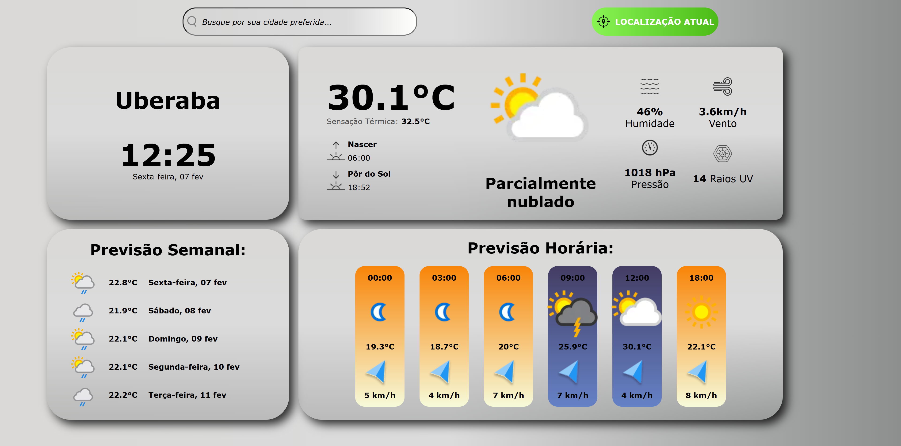

# 🌦️ Weather App - Previsão do Tempo




## Descrição do Projeto

Este projeto fornece informações meteorológicas em tempo real de forma clara e interativa. A interface é responsiva, garantindo uma experiência fluida tanto em desktop quanto em dispositivos móveis.

Principais Funcionalidades:
- 🌡️ Temperatura atual e sensação térmica.
- 💨 Umidade e velocidade do vento.
- ⏳ Previsão horária e semanal.
- 🌅 Informações sobre nascer e pôr do sol.
- ☀️ Índice de raios UV.
- 🌍 Suporte para múltiplas cidades.

## Tecnologias Utilizadas ⚙️

- **PHP 8.3** - Backend do projeto.
- **Laravel 11** - Framework PHP para desenvolvimento da aplicação.
- **Vite** - Build tool para otimização de frontend.
- **Redis** - Armazenamento em cache para melhorar a performance.
- **JavaScript** - Para interatividade no frontend.
- **Pest** - Framework de testes PHP para garantir a qualidade do código.


## Instruções para Rodar o Projeto 🚀

## 1. Pré-requisitos 🔧

Antes de iniciar, verifique se você tem os seguintes itens instalados em sua máquina:

- **PHP** (versão 8.x ou superior)
- **Composer** - Gerenciador de dependências do PHP
- **Node.js** e **NPM** - Para gerenciamento de pacotes e execução do frontend
- **Redis** - Para cache de dados em tempo real

---

## 2. Instalar Dependências 📦

* Clone o repositório e instale as dependências:

```bash
git clone https://github.com/marcelosiqqueira/girolando-test.git
cd girolando-test
```

* Instalar dependências do backend:


```bash
composer install
```

* Instalar dependências do frontend:


```bash
npm install
```

---


## 3. Configurar o Banco de Dados SQL Server 🗄️

O projeto está utilizando o Microsoft SQL Server como banco de dados, siga estas etapas para configurá-lo corretamente no Laravel:

* Instale o SQL Server e o Driver do PHP

Se ainda não tiver o SQL Server instalado, faça o download e instale-o a partir do site oficial da Microsoft:

[🔗 Download SQL Server](https://www.microsoft.com/pt-br/sql-server/sql-server-downloads)

Instale também o SQL Server Management Studio (SSMS) para gerenciar o banco de dados:

[🔗 Download SSMS](https://learn.microsoft.com/pt-br/sql/ssms/download-sql-server-management-studio-ssms?view=sql-server-ver16)

* Instale a Extensão do SQL Server no PHP

Se estiver rodando o projeto localmente, adicione o driver pdo_sqlsrv no PHP.

No Windows, edite o arquivo php.ini e habilite as seguintes linhas (removendo o ; do início, se necessário):

```bash
extension=php_pdo_sqlsrv.dll
extension=php_sqlsrv.dll
```

🔹 Importante: Certifique-se de que o SQL Server está rodando na porta 1433 e que o usuário tem permissões para acessar o banco de dados.


## 4. Configurar o Redis no PHP 

Certifique-se de que o Redis esteja rodando localmente. Caso não tenha o Redis instalado, você pode seguir as instruções no site oficial do Redis.

Para garantir que o Redis funcione corretamente no Laravel, é necessário configurar o PHP para suportar o Redis.

* Baixar e Instalar a DLL do Redis para PHP 8.3 (Windows)

    Se estiver rodando o projeto no Windows, você precisará adicionar a DLL do Redis ao PHP.

    1 - Faça o download da DLL compatível com PHP 8.3 no seguinte link:

    https://shuchkin.ru/2024/02/phpredis-for-windows-php-8-3-php_redis-dll/


    2 - Extraia e copie o arquivo php_redis.dll para a pasta de extensões do PHP (geralmente ext dentro da pasta do PHP).

* Ativar a Extensão Redis no php.ini

    Após adicionar a DLL, edite o arquivo php.ini do PHP e adicione a seguinte linha (ou remova o ; do início se já existir):

    ```bash
    extension=php_redis.dll
    ```


## 4. Configurar o Ambiente 🔑
Copie o arquivo .env.example para criar o arquivo de configuração .env:

```bash
cp .env.example .env
```

Agora, gere a chave da aplicação:

```bash
php artisan key:generate
```

Em seguida, defina a chave da API de previsão do tempo no arquivo .env:

```bash
WEATHER_API_KEY=SUAS_CHAVE_AQUI
```

## 5. Rodar o Projeto 🖥️
Após a configuração, basta rodar o projeto localmente:

* Iniciar o servidor Laravel:

```bash
php artisan serve
```

* Rodar o Vite para o frontend:

```bash
npm run dev
```

Certifique-se de que o Redis esteja rodando para otimizar o desempenho da aplicação.


## 6. Rodar Testes 🧪

Execute os testes automatizados para garantir que tudo está funcionando corretamente:

```bash
php artisan test
```

## 7. Acessar o Projeto 🌐

Abra o navegador e acesse a aplicação em:

```bash
http://localhost:8000
```


